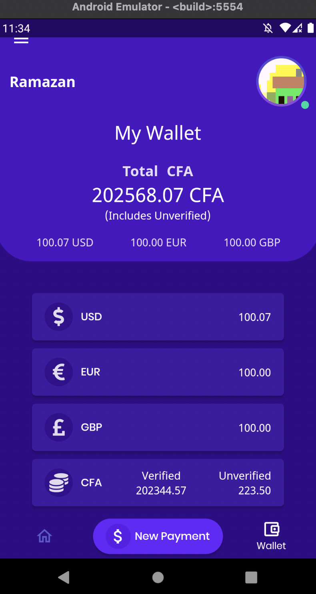

## UnoMoneyTransfer mobile application.
In this application the few things used:
- OTP Login
- Fade animation on scroller
- MVVM State Management
- Generic requests
- Responsive UI
- Pixel perfect design

    
    
    
    
    
    
    
    
    
    
    
    
    
    
    

